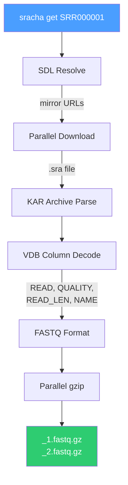

# sracha

Fast SRA downloader and FASTQ converter, written in pure Rust.

**Status: early development** -- download, VDB parsing, and FASTQ conversion are functional.

## Features

- **Parallel downloads** -- chunked HTTP Range requests with multiple connections
- **Native VDB parsing** -- pure Rust, zero C dependencies
- **Integrated pipeline** -- download, convert, and compress in one command
- **Project-level accessions** -- pass a BioProject (PRJNA) or study (SRP) to download all runs
- **Accession lists** -- batch download from a file with `--accession-list`
- **Parallel gzip** -- pigz-style block compression via rayon
- **SRA and SRA-lite** -- full quality or simplified quality scores
- **Split modes** -- split-3, split-files, split-spot, interleaved

## Quick start

```bash
# Download, convert, and compress
sracha get SRR000001

# Download all runs from a BioProject
sracha get PRJNA123456

# Batch download from an accession list
sracha get --accession-list SRR_Acc_List.txt

# Show accession info
sracha info SRR000001
```

## Building

Requires Rust 1.92+.

```bash
cargo build --release
```

Or with pixi:

```bash
pixi run release
```

## Architecture



## License

MIT
