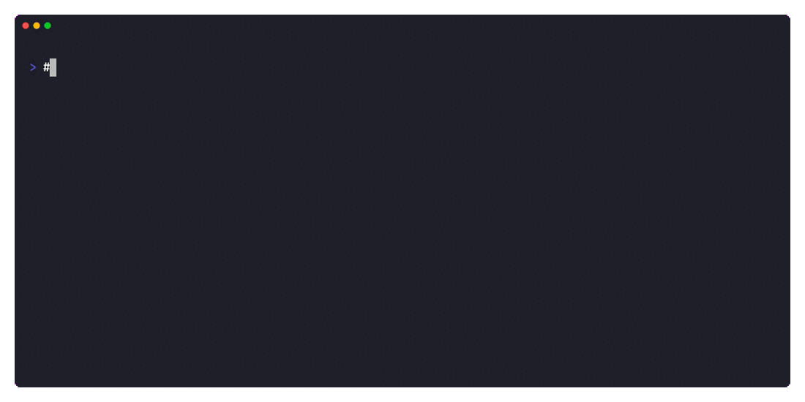

# 🌶️ sracha 🌶️

[](https://anaconda.org/bioconda/sracha) [](https://anaconda.org/bioconda/sracha)

Fast SRA downloader and FASTQ converter, written in pure Rust.



## Features

- **Fast** -- 5-13x faster than `fasterq-dump` on typical SRA files
- **One command** -- download, convert to FASTQ, and compress
- **Batch input** -- accessions, BioProjects (PRJNA), studies (SRP), or a file via `--accession-list`
- **gzip or zstd output** -- parallel compression, or plain FASTQ
- **FASTA output** -- `--fasta` drops quality scores
- **SRA and SRA-lite** -- full or simplified quality scores
- **Split modes** -- split-3, split-files, split-spot, interleaved
- **Resumable downloads** -- picks up where it left off
- **Stdout streaming** -- `-Z` pipes FASTQ straight into downstream tools
- **Integrity checks** -- MD5 verification on download and decode
- **Platform support** -- Illumina, BGISEQ/DNBSEQ, Element, Ultima, PacBio, Nanopore (legacy 454 and Ion Torrent are not supported)
- **Single static binary** -- no Python, no C dependencies

## Quick start

```bash
# Download, convert, and compress
sracha get SRR28588231

# Download all runs from a BioProject
sracha get PRJNA675068

# Batch download from an accession list
sracha get --accession-list SRR_Acc_List.txt

# Just download
sracha fetch SRR28588231

# Convert a local .sra file
sracha fastq SRR28588231.sra

# Show accession info
sracha info SRR28588231

# Validate a downloaded file
sracha validate SRR28588231.sra
```

## Benchmarks

### Local decode (SRA file on disk → FASTQ)

Uncompressed output, measured with
[hyperfine](https://github.com/sharkdp/hyperfine).

| File | Size | sracha | fasterq-dump | fastq-dump | Speedup vs fasterq-dump |
|:---|---:|---:|---:|---:|---:|
| SRR28588231 | 23 MiB | 0.14 s | 1.81 s | 1.95 s | **13.1x** |
| SRR2584863 | 288 MiB | 1.02 s | 5.63 s | 12.99 s | **5.5x** |
| ERR1018173 | 1.94 GiB | 6.26 s | 33.96 s | -- | **5.4x** |

`sracha` produces gzipped FASTQ by default (level 1, ~1.4× the
uncompressed time on small files thanks to parallel block compression),
so the integrated pipeline (`sracha get`) writes ready-to-use `.fastq.gz`
without a separate gzip step.

<details>
<summary>Full hyperfine output</summary>

**SRR28588231 (23 MiB, 66K spots, Illumina paired)**

| Command | Mean [ms] | Min [ms] | Max [ms] | Relative |
|:---|---:|---:|---:|---:|
| `sracha` | 138.2 ± 2.5 | 134.8 | 145.0 | 1.00 |
| `fasterq-dump` | 1812.0 ± 21.6 | 1791.4 | 1844.1 | 13.11 ± 0.28 |
| `fastq-dump` | 1951.8 ± 5.6 | 1944.4 | 1956.7 | 14.13 ± 0.26 |

**SRR2584863 (288 MiB, Illumina paired)**

| Command | Mean [s] | Min [s] | Max [s] | Relative |
|:---|---:|---:|---:|---:|
| `sracha` | 1.021 ± 0.010 | 1.011 | 1.031 | 1.00 |
| `fasterq-dump` | 5.633 ± 0.177 | 5.441 | 5.790 | 5.52 ± 0.18 |
| `fastq-dump` | 12.986 ± 0.019 | 12.973 | 13.008 | 12.71 ± 0.13 |

**ERR1018173 (1.94 GiB, 15.6M spots, Illumina paired, single run)**

| Command | Time [s] |
|:---|---:|
| `sracha` | 6.26 |
| `fasterq-dump` | 33.96 |

**sracha gzip overhead (SRR28588231, default `--gzip-level 1`)**

| Command | Mean [ms] | Min [ms] | Max [ms] | Relative |
|:---|---:|---:|---:|---:|
| `sracha (no compression)` | 138.1 ± 2.7 | 133.7 | 143.5 | 1.00 |
| `sracha (gzip)` | 204.6 ± 1.7 | 202.3 | 208.8 | 1.48 ± 0.03 |

</details>

Benchmarks run with `sracha` v0.3.10, `sra-tools` v3.4.1, on Linux
(8 CPUs). Install the reference toolkit with `pixi run install-sratools`
and reproduce with `validation/benchmark.sh`.

## Installation

Install via [Bioconda](https://bioconda.github.io/):

```bash
pixi add bioconda::sracha
```

Or download pre-built binaries from the
[releases page](https://github.com/rnabioco/sracha-rs/releases),
or install from source:

```bash
cargo install --git https://github.com/rnabioco/sracha-rs sracha
```

On x86_64 the release page carries two variants per platform: pick **`-v2`**
(the safe default — runs on any CPU since ~2009), or **`-v3`** for extra SIMD
throughput on Haswell-or-newer (2013+) hardware. A `-v3` binary aborts with an
illegal-instruction fault at startup on older CPUs, so prefer `-v2` unless you
know the host has AVX2. ARM builds (`aarch64`) ship a single binary.

To build from source tuned for the current machine, set
`RUSTFLAGS="-C target-cpu=native"` before `cargo install`/`cargo build --release`.

### Containers

Because sracha is on Bioconda, [BioContainers](https://biocontainers.pro/)
automatically publishes a Docker/Singularity image for every release — no
local build required.

```bash
# Docker / Podman
docker run --rm quay.io/biocontainers/sracha:0.4.2--h54198d6_0 sracha --help

# Singularity / Apptainer
singularity run \
  https://depot.galaxyproject.org/singularity/sracha:0.4.2--h54198d6_0 sracha --help
```

These tags track the current Bioconda release and are refreshed weekly by a
CI job. BioContainers builds an image a day or two behind a new release, so
just after a release the tag here may still name the previous version — see
[quay.io](https://quay.io/repository/biocontainers/sracha?tab=tags) for every
published `<version>--<build>` tag.

Using sracha in a workflow manager? See
[Nextflow and workflow integration](https://rnabioco.github.io/sracha-rs/#nextflow)
in the docs.

## Documentation

Full CLI reference and usage guide: <https://rnabioco.github.io/sracha-rs/>

## Acknowledgments

sracha builds on the [Sequence Read Archive](https://www.ncbi.nlm.nih.gov/sra),
maintained by the [National Center for Biotechnology Information](https://www.ncbi.nlm.nih.gov/)
at the National Library of Medicine. The SRA and its
[toolchain](https://github.com/ncbi/sra-tools) are public-domain software
developed by U.S. government employees — our tax dollars at work. Special
thanks to Kenneth Durbrow ([@durbrow](https://github.com/durbrow)) and the
SRA Toolkit team for building and maintaining the infrastructure that makes
projects like this possible.

This project wouldn't exist without NCBI's open infrastructure: the
VDB/KAR format, the SDL locate API, EUtils, and public S3 hosting of
sequencing data. sracha aims to make it easier for the community to
build on that foundation.

## License

MIT
